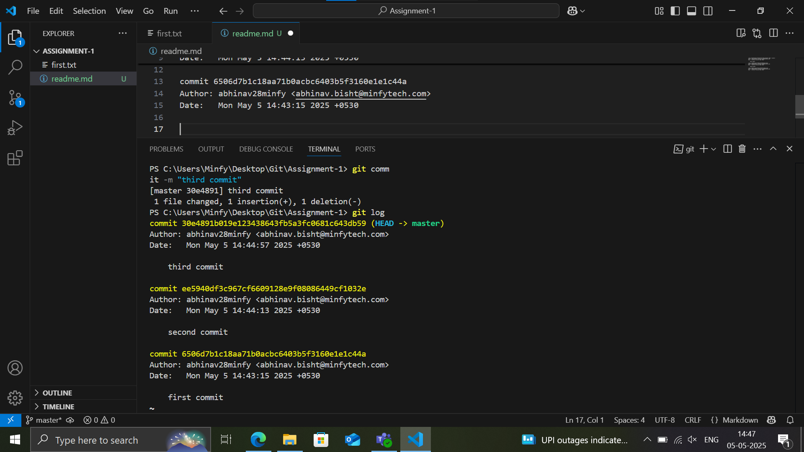
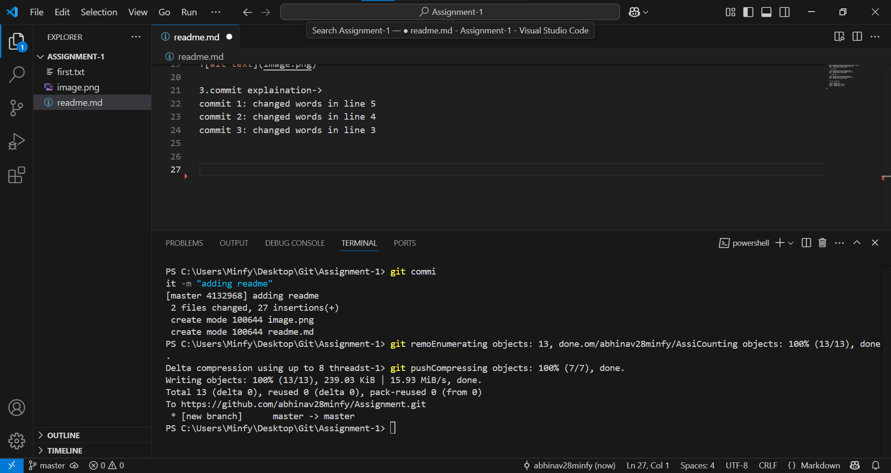
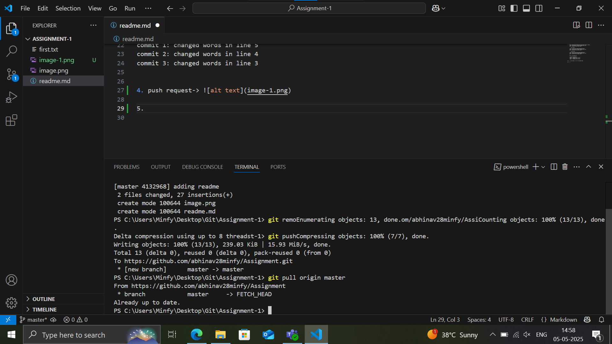
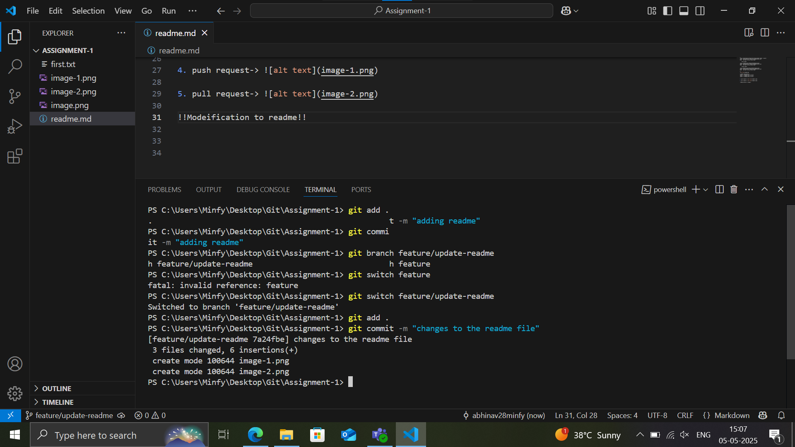

1.
commit 30e4891b019e123438643fb5a3fc0681c643db59 (HEAD -> master)
Author: abhinav28minfy <abhinav.bisht@minfytech.com>
Date:   Mon May 5 14:44:57 2025 +0530

    third commit

commit ee5940df3c967cf6609128e9f08086449cf1032e
Author: abhinav28minfy <abhinav.bisht@minfytech.com>
Date:   Mon May 5 14:44:13 2025 +0530

    second commit

commit 6506d7b1c18aa71b0acbc6403b5f3160e1e1c44a
Author: abhinav28minfy <abhinav.bisht@minfytech.com>
Date:   Mon May 5 14:43:15 2025 +0530

2.

3.commit explaination->
commit 1: changed words in line 5
commit 2: changed words in line 4
commit 3: changed words in line 3

4. push request-> 

5. pull request-> 

!!Modeification to readme!!

6. branching(creating feature/update-readme + modifying readme)

